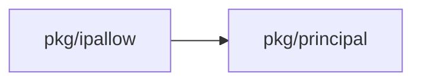
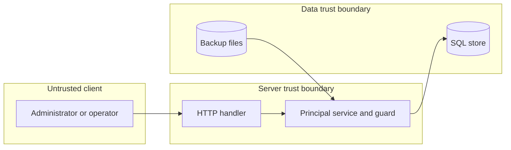

## Context

The guard must make the loss of the last working path impossible under concurrent writes. The first-setup gate is not part of this change: no setup-finish flow exists on main, and the change keep-two-break-glass-at-setup owns it.

## Decisions

1. **One count function.** One function in pkg/principal counts working accounts with the four properties and the passkey or hardware key. The guard and the restore check call it. It reads the final rows of the transaction.
1a. **Count of one namespace.** The count function of decision 1 has two scopes. `CountWorkingBreakGlass` keeps the installation scope. The NEW method `CountWorkingBreakGlassInNamespace(ctx, ns namespace.Name, at time.Time) (int64, error)` on `WorkingBreakGlassCounter` in pkg/principal/breakglass_count.go counts the break-glass principals of the namespace ns with the role admin on ns, and no principal of another namespace. It returns ErrBreakGlassUnavailable when the store cannot count, and ErrInvalid for an empty ns. The conformance cases are written first in pkg/principal/principaltest/breakglass_count.go. The sqlite adapter (internal/store/sqlite/breakglass_floor.go) and the postgres adapter (internal/store/postgres/breakglass_floor.go) implement it. The postgres query `CountWorkingBreakGlassPrincipals` in internal/store/postgres/queries.sql takes the namespace as a parameter, and `make generate` writes internal/store/postgres/internal/db/queries.sql.go. The sqlite adapter uses its own SQL text, not sqlc, so no sqlite generated file changes. The floor check of a restore stays atomic inside the swap transaction of each adapter, and pkg/backup/restore.go makes no call. The swap uses the transaction-bound helper `breakGlassScopeCounts` (NEW, with `q := s.queries.WithTx(tx)` on PostgreSQL), not the public port method, which stays for its conformance suite and for the namespace test in pkg/principal. On PostgreSQL the swap is `swapInWithBreakGlassFloor` (internal/store/postgres/restore.go:247), the one function that counts before and after the swap; the change touches that file. On SQLite the swap is `replayStagedRevocations` (internal/store/sqlite/breakglass_floor.go:40), and the NEW function `checkNamespaceFloors` in the same file compares the namespace counts. A restore that leaves a namespace with too few working accounts is refused on both.
2. **Two rules by change kind.** Disable and delete use the rule that one enabled account must stay. The restore uses the floor of two. A change that does not lower the count, or raises it, is never refused (Owner decision, 13 Nov 2026 (queue P19)). The other lowering writes (access Revoke, RemovePasskey and the IP allowlist writes) are the change break-glass-floor-other-writes.
3. **Conditional SQL update.** The disable and the delete are one SQL statement each, with a condition that another enabled break-glass account stays in the same scope. The database serializes two parallel statements on the same rows, so the second one sees the first one's result and matches no row. A sign-in takes no guard step.
3a. **The sweep stays exempt.** The SQL of the sweep keeps its exemption of break-glass accounts, as on main. For each break-glass account that the sweep skips, the sweep writes one audit record with the entry shape of the sweep (pkg/accesstoken/service.go, function change): Namespace @server, Kind change, Outcome success, Object the principal reference of the account, Reason "break-glass account is exempt", and the caller fields of the entry that the sweep got. A run that skips no account writes no such record.
4. **Restore check and swap.** The restore counts the staged data per scope before the swap. The swap then counts again on the staged rows in its own transaction. If the count fails there, or the swap fails half way, the transaction rolls back and the live data stays. The restore of access tables follows the setting of the other change and never skips this count.
5. **Atomic rotation.** Rotation is one transaction, in one new port method of the passkey port, not a call of AddPasskey and then RemovePasskey (internal/mfasvc/service.go:553 RemovePasskey is its own transaction, and a process stop between the two calls leaves the account with the old or both credentials but never an ended old one before a new one). The method is `RotatePasskey(ctx, personID, oldID string, next Passkey, e audit.Entry) error` on PasskeyStore in pkg/mfa/mfa.go. It locks the row of the person, inserts the new passkey, ends the old one and appends e in one transaction. The adapters are internal/store/sqlite/passkeys.go and internal/store/postgres/passkeys.go. The service method RotatePasskey in internal/mfasvc/service.go calls it. A failed insert rolls back and the old credential stays. A second parallel rotation of the same account waits for the row lock and then sees the new credential. An id that is not a break-glass account gives 404. The conformance cases of the method (pkg/mfa/mfatest/passkeys.go) are written before any adapter implements it.
5a. **Atomic add.** The add of a break-glass account stores the account, its first passkey and the audit entry in one transaction, not an insert followed by AddPasskey and not a compensating delete. It is one NEW port method `AddBreakGlassPerson(ctx, person principal.Principal, first Passkey, e audit.Entry) error` on PasskeyStore in pkg/mfa/mfa.go, in the pattern of decision 5. It sits on PasskeyStore and not on the principal store, because its parameter type Passkey is in pkg/mfa, and pkg/mfa imports (read only) `pkg/session`, which imports pkg/principal: a method of the principal store that takes a Passkey would make an import cycle. The shared body is one function in internal/store/passkeystore/passkeystore.go, next to the body of RotatePasskey. It calls a NEW principal insert on the transaction interface of that package, which both adapters give from their own insertPrincipal. It inserts the account, inserts the passkey and appends e. A failed passkey insert rolls back, so no account stays. The method returns ErrInvalid for a principal that is not a person, ErrAlreadyExists for a principal, passkey or credential ID that exists, and ErrLimit. The conformance cases in pkg/mfa/mfatest/passkeys.go are written before any adapter implements it. The service method AddBreakGlassPerson in internal/mfasvc/service.go calls it and not AddPasskey.
6. **Fresh authentication.** Rotation, add and each guarded change need a fresh authentication in the one window.
7. **Disable side effects.** Each disable writes an audit entry. The notice to the other administrators is the change break-glass-disable-notice. Re-enable runs the same checks as an add. Disable works in maintenance mode.

## Actions and error codes

No new action exists. A break-glass account is a principal, so the routes reuse the actions of principals, each on the object @server (ServerObject): `server:read-principals` for the list route, and `server:manage-principals` for add, rotate, disable, re-enable and every guarded change. The action list and the role table do not change. A new action would add authorization surface and role edits for no gain, because the holders of manage-principals already manage these accounts. The fresh authentication step and the floor guard still apply to each write route.

The code principal.no-working-break-glass answers 409 for a refused disable, a refused delete and a refused restore. The code break-glass.not-found is new in internal/errcode/catalog_breakglass.go, with its line in internal/errcode/testdata/catalog/break-glass.txt, and the adapter maps it to 404.

A person with no enrolled factor gets 403 with mfa.fresh-step-required from the handler in internal/api/server/break_glass.go. The text names `/api/dustpan/v1/me/passkeys/register/begin`, the route that starts a passkey enrollment. A test in internal/api/server/break_glass_fresh_test.go fails when the text loses that path.

The RotatePasskey transaction body is one function in internal/store/passkeystore/passkeystore.go, next to RemovePasskey. internal/store/sqlite/passkeys.go and internal/store/postgres/passkeys.go call it, so the two adapters share one body.

## Structure

An unexported type breakGlassSet in pkg/principal. Only its constructor loads the rows of the scope. Its methods requireNotLast (disable, delete) and requireFloor (restore) return the one sentinel ErrNoWorkingBreakGlass, which the adapter maps to principal.no-working-break-glass. Each covered write takes the set from the transaction, so no write path skips the count.

## Risks

- Two parallel disables read the same count. The conditional update makes the second one match no row.
- A restore of an old backup drops accounts. The restore check runs before the swap and again in the swap transaction.
- An account is disabled and a stored count would stay old. The list route computes the count from the live rows at read time.

## Layers (defense in depth)

| Layer | Guard | Hostile test |
| --- | --- | --- |
| service | The service builds the set in the write transaction and returns the sentinel by change kind. | Disable the last two accounts in parallel. One request fails with 409. |
| store adapter | The store checks the count and the fence in the same SQL statement, with the condition of the update. | Call the store directly to delete the last enabled account. The store refuses. |
| HTTP handler | The handler declares server:read-principals (list) or server:manage-principals (write) on ServerObject, requires a fresh authentication and maps each sentinel to 409. | Send a disable with a stale fresh step to the break-glass route. The handler answers 403 before the service runs. The fresh step lives in the HTTP layer, so the test is in internal/api/server. |

## Diagrams

Modules that the change touches, and their imports on main:

```mermaid
flowchart LR
P1[pkg/ipallow]
P2[pkg/principal]
P1 --> P2
```

States on main in the touched packages:

```mermaid
stateDiagram-v2
active
suspended
```

## Quality attributes

| Attribute | Target | Unit | Scope |
| --- | --- | --- | --- |
| Guard latency | 200 | milliseconds, 99th percentile added to a guarded write | each guarded change on one installation with up to 50 break-glass accounts |
| Count accuracy | 0 | commits that leave fewer than the required working paths | every covered write under parallel load in the conformance suite |

## Threat model

Data flow and trust boundaries:

```mermaid
flowchart LR
 subgraph Client[Untrusted client]
 A[Administrator or operator]
 end
 subgraph Server[Server trust boundary]
 H[HTTP handler]
 S[Principal service and guard]
 end
 subgraph Data[Data trust boundary]
 D[(SQL store)]
 B[(Backup files)]
 end
 A --> H
 H --> S
 S --> D
 B --> S
```

| Boundary | STRIDE | Threat | Layer | Guard | Hostile test |
| --- | --- | --- | --- | --- | --- |
| Client to server | E | A caller without a fresh authentication rotates or adds a break-glass credential, or takes over the recovery account. | boundary check | The handler validates the id and the body, and rejects anything that is not a break-glass account. | Send a rotate request with a malformed id and with a non-break-glass id. Both get 404 or 400. |
| Client to server | E | A caller without a fresh authentication rotates or adds a break-glass credential, or takes over the recovery account. | encode or contain | The store uses SQL placeholders only, and the id is a stable principal ID, never a name. | Send an id with SQL text and a name of another account. The store matches no row and returns not found. |
| Client to server | E | A caller without a fresh authentication rotates or adds a break-glass credential, or takes over the recovery account. | limit | The request body has a size limit and a rotation takes one account at a time. | Send an oversized body and a list of ids. The handler rejects both. |
| Client to server | E | A caller without a fresh authentication rotates or adds a break-glass credential, or takes over the recovery account. | authorize at point of use | The service checks server:manage-principals (server:read-principals for the list) on @server and the fresh authentication for the object. | Call the service directly with a stale fresh step. It refuses. |
| Client to server | E | A caller without a fresh authentication rotates or adds a break-glass credential, or takes over the recovery account. | fail closed | An unknown error or a missing fresh step denies and writes an audit entry. | Break the fresh-step lookup. The call is denied and the audit log records it. |
| Server to data | D | A disable, delete or restore removes the last working path and locks every administrator out. | boundary check | The service checks the change kind and the target before it builds the set. | Send a disable with an unknown change kind or a target of another scope. The service refuses. |
| Server to data | D | A disable, delete or restore removes the last working path and locks every administrator out. | encode or contain | The set loads rows by scope key with placeholders, so a change cannot count rows of another scope. | Disable an account of namespace A and check that the count of namespace B is unchanged. |
| Server to data | D | A disable, delete or restore removes the last working path and locks every administrator out. | limit | The guard counts working paths in the write statement and refuses below the rule of the change kind. | Disable the last two accounts in parallel. One request fails with 409. |
| Server to data | D | A disable, delete or restore removes the last working path and locks every administrator out. | authorize at point of use | The store checks the count again in the same statement, for each caller of the write path. | Call the store directly to delete the last enabled account. The store refuses. |
| Server to data | D | A disable, delete or restore removes the last working path and locks every administrator out. | fail closed | A condition that matches no row changes nothing and answers principal.no-working-break-glass. | Disable the last enabled account. The answer is 409 and the row is unchanged. |
| Backup files to server | T | A restored backup brings fewer break-glass accounts, or accounts that a policy blocks. | boundary check | The restore counts staged rows per scope before it runs the swap. | Restore a backup whose accounts are all disabled. The restore is refused. |
| Backup files to server | T | A restored backup brings fewer break-glass accounts, or accounts that a policy blocks. | encode or contain | The staged rows stay in a separate area until the swap, so the live tables stay unchanged. | Refuse a restore and read the live tables. They are unchanged. |
| Backup files to server | T | A restored backup brings fewer break-glass accounts, or accounts that a policy blocks. | limit | The swap counts again on the staged rows in its own transaction, so a write that runs in the swap cannot change the result. | Start a disable during the swap. The count of the swap includes its result. |
| Backup files to server | T | A restored backup brings fewer break-glass accounts, or accounts that a policy blocks. | authorize at point of use | The swap transaction counts again on the staged rows, whatever the first check said. | Change the staged rows after the first check. The swap refuses. |
| Backup files to server | T | A restored backup brings fewer break-glass accounts, or accounts that a policy blocks. | fail closed | A failed swap rolls back and the live data stays. | Fail the swap half way. The live count is unchanged. |
| Client to server | R | A refused or accepted guarded change leaves no record of who did it. | boundary check | The handler sets the actor and the channel from the checked identity, never from the body. | Send a body with a forged actor. The audit entry names the real caller. |
| Client to server | R | A refused or accepted guarded change leaves no record of who did it. | encode or contain | The audit writer removes CR and LF from each text field. | Send a reason with line breaks. The entry holds one line. |
| Client to server | R | A refused or accepted guarded change leaves no record of who did it. | limit | The audit entry is written in the same transaction as the change, with a size limit on its fields. | Send a very long reason. The entry is cut or refused and the change is consistent. |
| Client to server | R | A refused or accepted guarded change leaves no record of who did it. | authorize at point of use | Only the guard path writes the refusal entry, with the action of the route. | Read the entry of a refusal. It names the action and the object. |
| Client to server | R | A refused or accepted guarded change leaves no record of who did it. | fail closed | Each refusal, disable and skipped sweep account writes an audit entry in the same transaction, and a failed write fails the change. | Fail the audit write. The change is not stored. |

## Failure modes

| Step | Failure | Retry | State after |
| --- | --- | --- | --- |
| Disable or delete with a parallel disable of the other account | The condition of the second statement matches no row. | The caller reads the list and decides. | The first change is stored and the second one changes nothing. |
| Rotate: insert the new credential and end the old one | The insert fails or the process stops before commit. | The caller sends the rotation again. | The transaction rolls back and the old credential stays active. |
| Add: insert the account, insert the first passkey | The passkey insert fails or the process stops before commit. | The caller sends the add again. | The transaction rolls back and no account, no passkey and no audit entry stay. |
| Restore swap with a second count | The count is below two, or the swap fails half way. | The operator restores a backup with at least two working accounts. | The transaction rolls back and the live data stays. |
